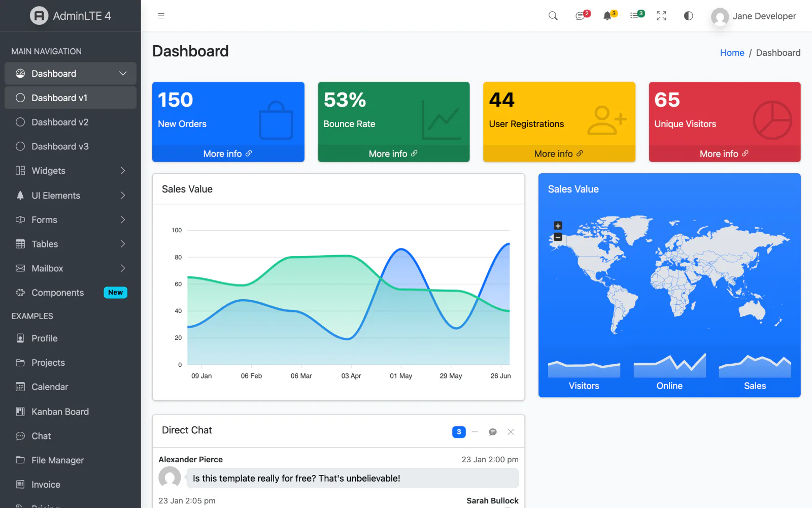

# AdminLTE 4 for Angular

The official **[AdminLTE 4](https://adminlte.io)** port for **Angular 22** — a signal-first, standalone-component library on **Bootstrap 5.3**. Dark mode, a config-driven sidebar, and a ⌘K command palette, all without jQuery or NgModules.

[](./LICENSE)
[](https://angular.dev)
[](https://getbootstrap.com)
[](https://www.typescriptlang.org/)
[](https://angular.dev/guide/signals)

**🔗 [Live demo](https://adminlte-angular.pages.dev)** · **📚 [Documentation](https://docs.adminlte.io/angular/introduction)**

> Standalone components, signal inputs (`input()`/`output()`/`model()`), the new control flow (`@if`/`@for`/`@switch`), SSR-safe theming, and the modern esbuild application builder.

## Also available for your stack

The same AdminLTE 4 dashboard, in the framework you know best — you're looking at the **Angular** edition:

<!-- ADMINLTE-ECOSYSTEM:START -->
<div align="center">
  <a href="https://github.com/ColorlibHQ/AdminLTE"></a>
  <a href="https://github.com/ColorlibHQ/adminlte-react"></a>
  <a href="https://github.com/ColorlibHQ/adminlte-react"></a>
  <a href="https://github.com/ColorlibHQ/adminlte-vue"></a>
  <a href="https://github.com/ColorlibHQ/adminlte-vue"></a>
  <a href="https://github.com/ColorlibHQ/adminlte-angular"></a>
  <a href="https://github.com/ColorlibHQ/adminlte-laravel"></a>
  <a href="https://github.com/ColorlibHQ/adminlte-symfony"></a>
  <a href="https://github.com/ColorlibHQ/adminlte-django"></a>
  <a href="https://github.com/ColorlibHQ/adminlte-aspnet"></a>
  <a href="https://github.com/ColorlibHQ/adminlte-drupal"></a>
  <a href="https://docs.adminlte.io"></a>
</div>
<!-- ADMINLTE-ECOSYSTEM:END -->

<p align="center">
  <a href="https://adminlte-angular.pages.dev"></a>
</p>


## Features

- 🅰️ **Angular 22, signal-first** — standalone components, `input()`/`output()`/`model()`, the new control flow, zoneless-friendly.
- 🌗 **SSR-safe dark mode** — `data-bs-theme` on `<html>`, persisted to `localStorage` with a system-preference fallback and a no-flash inline script.
- 🧭 **Config-driven sidebar** — a typed `MenuNode[]` (headers, links, collapsible groups, badges, per-item `visible` flags) with active-link detection and accordion treeviews.
- ⌘ **Command palette (⌘K)** — fuzzy search over your menu with full keyboard navigation, routing through the Angular Router.
- 🧩 **40+ components** — layout, widgets and form controls, all with the `Lte` prefix.
- 📦 **Tree-shakeable** — standalone components, optional peer deps (Chart.js, flatpickr, Tom Select, simple-datatables) lazy-loaded.
- 📊 **Chart.js charts** — `<lte-chart>` wraps [Chart.js](https://www.chartjs.org/) (MIT) with an AdminLTE theme preset that follows dark mode live.
- 🎨 **Bootstrap 5.3** — ships AdminLTE's compiled CSS via `@adminlte/angular/css`.

## Installation

```bash
npm install @adminlte/angular admin-lte bootstrap bootstrap-icons
# optional, for charts:
npm install chart.js
```

`@adminlte/angular` lists `@angular/core`, `@angular/common`, `@angular/forms`, `@angular/router`, `bootstrap` and `admin-lte` as peer dependencies.

### 1. Add the styles

In `angular.json` (or your global stylesheet):

```jsonc
"styles": [
  "node_modules/bootstrap-icons/font/bootstrap-icons.css",
  "node_modules/@adminlte/angular/css/adminlte.css",
  "src/styles.css"
]
```

### 2. No-flash theme script

Add this to your `index.html` `<head>` so the correct theme is applied before first paint:

```html
<script>
  (function () {
    try {
      var m = localStorage.getItem('lte-theme') || 'auto';
      var d = m === 'dark' || (m === 'auto' && window.matchMedia('(prefers-color-scheme: dark)').matches);
      document.documentElement.setAttribute('data-bs-theme', d ? 'dark' : 'light');
    } catch (e) {}
  })();
</script>
```

(`COLOR_MODE_NO_FLASH_SCRIPT` is also exported from the library for SSR injection.)

## Usage

Define a typed menu and drop the dashboard layout around your routed content:

```ts
import { Component, signal } from '@angular/core';
import { RouterOutlet } from '@angular/router';
import { DashboardLayoutComponent, type MenuNode } from '@adminlte/angular';

const MENU: MenuNode[] = [
  { type: 'header', text: 'MAIN NAVIGATION' },
  { type: 'item', text: 'Dashboard', route: '/', icon: 'bi-speedometer' },
  {
    type: 'group',
    text: 'UI Elements',
    icon: 'bi-collection',
    children: [
      { type: 'item', text: 'Forms', route: '/forms', icon: 'bi-input-cursor-text' },
      { type: 'item', text: 'Tables', route: '/tables', icon: 'bi-table' },
    ],
  },
  { type: 'item', text: 'Admin only', route: '/admin', icon: 'bi-lock', visible: false },
];

@Component({
  selector: 'app-shell',
  imports: [DashboardLayoutComponent, RouterOutlet],
  template: `
    <lte-dashboard-layout [menuItems]="menu" [currentPath]="currentPath()" [accordion]="true">
      <router-outlet />
      <span footer><b>Version</b> 4.8.1</span>
    </lte-dashboard-layout>
  `,
})
export class ShellComponent {
  readonly menu = MENU;
  readonly currentPath = signal('/'); // wire from Router NavigationEnd events
}
```

Then build a page with the widgets:

```html
<lte-app-content title="Dashboard" [breadcrumbs]="[{ label: 'Home', route: '/' }, { label: 'Dashboard' }]">
  <div class="row">
    <div class="col-lg-3 col-6">
      <lte-small-box title="150" text="New Orders" icon="bi-bag" theme="primary" url="#" />
    </div>
  </div>

  <lte-card title="Sales" icon="bi-bar-chart" [collapsible]="true" [maximizable]="true">
    <lte-chart type="line" [data]="salesData()" [options]="salesOptions" [height]="300" />
  </lte-card>
</lte-app-content>
```

## Components

**Layout** — `LteDashboardLayout` · `LteAuthLayout` · `LteAppContent` · `LteTopbar` · `LteSidebar` · `LteSidebarBrand` · `LteSidebarNav` · `LteSidebarNavItem` · `LteSidebarOverlay` · `LteFooter` · `LteColorModeToggle` · `LteFullscreenToggle`

**Widgets** — `LteCard` · `LteSmallBox` · `LteInfoBox` · `LteAlert` · `LteCallout` · `LteProgress` · `LteProgressGroup` · `LteRatings` · `LteTimeline` · `LteProfileCard` · `LteDescriptionBlock` · `LteBreadcrumb` · `LteCommandPalette` · `LteChart` · `LteModal` · `LteDirectChat` · `LteTabs` / `LteTab` · `LteAccordion` / `LteAccordionItem` · `LteDatatable`

**Topbar dropdowns** — `LteNavMessages` · `LteNavNotifications` · `LteNavTasks` (drop into the topbar `[topbar-end]` slot)

**Forms** — `LteButton` · `LteInput` · `LteSelect` · `LteTextarea` · `LteInputSwitch` · `LteInputFlatpickr` · `LteInputTomSelect` (all `ControlValueAccessor` + `model()` two-way binding)

**Optional plugin wrappers** lazy-load their library only when used: `LteChart` (chart.js), `LteInputFlatpickr` (flatpickr), `LteInputTomSelect` (tom-select), `LteDatatable` (simple-datatables). Install the ones you need:

```bash
npm install chart.js flatpickr tom-select simple-datatables
```

> Selectors use the `lte-` prefix (`<lte-card>`); class names use the `Lte…Component` convention.

## Charts

Charts are [Chart.js](https://www.chartjs.org/) 4.5 (MIT). `<lte-chart>` takes the standard
Chart.js `type`, `data` and `options`, loads `chart.js` lazily in the browser only (SSR-safe),
updates in place when its inputs change, resizes with its container and destroys the chart
when the component is destroyed.

```ts
import { Component, computed, inject } from '@angular/core';
import type { ChartData, ChartOptions } from 'chart.js';
import { ChartComponent, ChartThemeService, verticalGradient } from '@adminlte/angular';

@Component({
  selector: 'app-sales',
  imports: [ChartComponent],
  template: `<lte-chart type="line" [data]="data()" [options]="options" [height]="300" />`,
})
export class SalesComponent {
  private readonly theme = inject(ChartThemeService);

  // Build colours from the palette so they follow light/dark mode.
  readonly data = computed<ChartData<'line'>>(() => {
    const { colors } = this.theme.palette();
    return {
      labels: ['Jan', 'Feb', 'Mar', 'Apr', 'May', 'Jun', 'Jul'],
      datasets: [
        {
          label: 'Digital Goods',
          data: [28, 48, 40, 19, 86, 27, 90],
          borderColor: colors.primary,
          backgroundColor: verticalGradient(colors.primary),
          fill: 'origin',
        },
      ],
    };
  });

  readonly options: ChartOptions<'line'> = { plugins: { legend: { display: false } } };
}
```

The first `<lte-chart>` applies the AdminLTE preset to Chart.js' global `Chart.defaults`
(Bootstrap font, `--bs-*` colours, subtle gridlines, rounded bars, Bootstrap-style tooltip and
legend). `ChartThemeService` re-reads the CSS variables whenever `<html>` changes
`data-bs-theme`, `dir` or `data-lte-primary`, and every chart re-themes live. RTL documents get
right-to-left legends and tooltips.

### Migrating from `LteApexChart` (0.3.x → 0.4.0)

0.4.0 replaces the previous chart wrapper (`LteApexChart` / `ApexChartComponent`), whose chart
library is no longer MIT-licensed, with `LteChart` on Chart.js. Remove the old chart package,
run `npm install chart.js`, import `ChartComponent` instead of `ApexChartComponent`, and rewrite
each options object as Chart.js `type` / `data` / `options` (details in the
[CHANGELOG](CHANGELOG.md)):

| Before | After |
|---|---|
| `<lte-apex-chart [options]="opts" />` | `<lte-chart type="line" [data]="data" [options]="options" [height]="300" />` |
| `chart: { type: 'area' }`, `stroke: { curve: 'smooth' }` | `type="line"`, dataset `fill: 'origin'` (lines are smooth by default) |
| `chart: { type: 'bar' }`, `plotOptions.bar.horizontal` | `type="bar"`, `options.indexAxis: 'y'` |
| `chart: { type: 'donut' }`, `series` + `labels` | `type="doughnut"`, `data.labels` + `datasets[0].data` |
| `chart: { height: 300 }` | `[height]="300"` on `<lte-chart>` |
| `sparkline: { enabled: true }` | hide `scales.x`/`scales.y`, legend and tooltip |
| `colors: ['#0d6efd']` | `ChartThemeService.palette().colors.primary` |

## Services

State is exposed through `providedIn: 'root'` signal services:

| Service | Responsibility |
|---|---|
| `ColorModeService` | light/dark/auto, `data-bs-theme`, `localStorage` persistence, system fallback |
| `SidebarService` | responsive collapse/overlay/mini state + `<body>` classes |
| `CommandPaletteService` | ⌘K open/close + global key listener |
| `FullscreenService` | Fullscreen API wrapper, `fullscreenchange`-driven |
| `TreeviewService` | sidebar accordion/expand registry (provided per sidebar) |
| `ChartThemeService` | Chart.js palette from the `--bs-*` variables, re-read on colour-mode/direction change |

## Development

```bash
npm install          # install workspace deps
npm run build        # build the library (ng-packagr) + copy AdminLTE CSS
npm start            # serve the demo at http://localhost:4200
npm run build:demo   # production build of the demo app
```

The repo is an Angular workspace: the library lives in `projects/adminlte-angular`, the demo that dogfoods it in `projects/demo`.

## Browser support

Modern evergreen browsers (Chrome, Edge, Firefox, Safari). Matches Bootstrap 5.3 and Angular 22 support targets.

## License

[MIT](./LICENSE) © 2014–2026 ColorlibHQ. Built on [AdminLTE](https://github.com/ColorlibHQ/AdminLTE).
